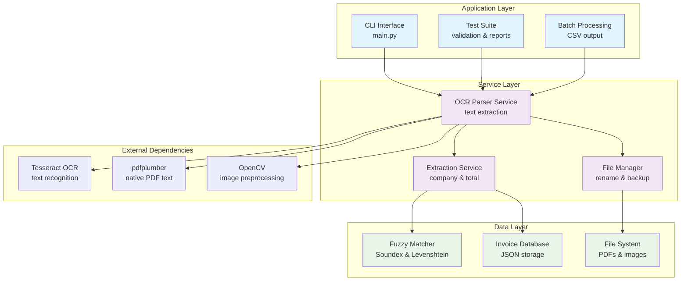
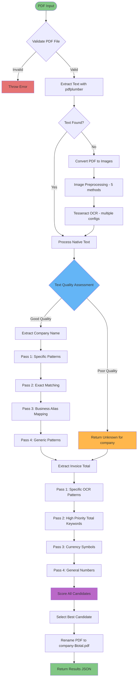
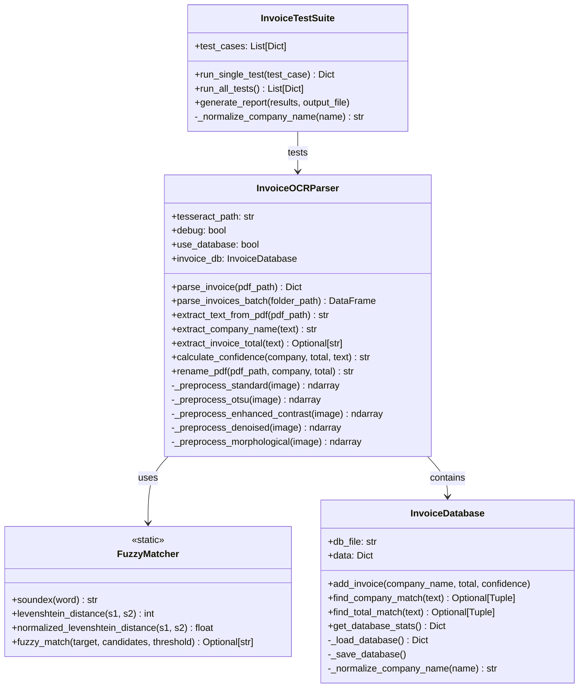

# OCR Invoice Parser - Functional Specification

## 1. System Overview

### 1.1 Purpose
The OCR Invoice Parser is a Python-based system that extracts company names and invoice totals from PDF invoices using OCR (Optical Character Recognition) and text extraction techniques. The system automatically renames processed PDF files using the extracted information.

### 1.2 Key Features
- **Dual Text Extraction**: Uses both native PDF text extraction and OCR fallback
- **Robust Pattern Matching**: Employs specific patterns and fuzzy matching for data extraction
- **Quality Assessment**: Evaluates OCR quality and returns "Unknown" for poor-quality text
- **Automatic File Renaming**: Renames PDFs to `company_name-$total.pdf` format
- **Batch Processing**: Processes multiple invoices and generates CSV reports
- **Test Suite**: Comprehensive testing framework with backup/restore capabilities

### 1.3 Technology Stack
- **Python 3.8+**
- **Tesseract OCR Engine**
- **pdf2image**: PDF to image conversion
- **pdfplumber**: Native PDF text extraction
- **PIL (Pillow)**: Image processing
- **OpenCV**: Advanced image preprocessing
- **pandas**: Data manipulation and CSV generation
- **NumPy**: Numerical operations

## 2. Architecture Overview

### 2.1 System Architecture



### 2.2 Processing Workflow



## 3. Functional Requirements

### 3.1 Text Extraction Module

#### 3.1.1 Primary Text Extraction (pdfplumber)
- **Input**: PDF file path
- **Process**: Extract native text content from PDF
- **Output**: Raw text string
- **Fallback**: If no text found, proceed to OCR

#### 3.1.2 OCR Text Extraction (Tesseract)
- **Input**: PDF file (converted to images)
- **Process**:
  1. Convert PDF pages to images (300 DPI)
  2. Apply image preprocessing techniques
  3. Run multiple OCR configurations
  4. Select best result based on confidence
- **Output**: OCR-extracted text string

#### 3.1.3 Image Preprocessing Pipeline
1. **Standard**: Basic grayscale conversion
2. **Otsu Thresholding**: Automatic binarization
3. **Enhanced Contrast**: CLAHE (Contrast Limited Adaptive Histogram Equalization)
4. **Denoising**: Gaussian blur + bilateral filtering
5. **Morphological**: Opening/closing operations for text enhancement

#### 3.1.4 OCR Configuration Matrix
```python
OCR_CONFIGS = [
    '--psm 6 --oem 3',   # Single uniform text block
    '--psm 4 --oem 3',   # Single column of text
    '--psm 3 --oem 3',   # Automatic page segmentation
    '--psm 1 --oem 3',   # Automatic with OSD
    '--psm 12 --oem 3'   # Sparse text
]
```

### 3.2 Company Name Extraction Module

#### 3.2.1 Text Quality Assessment
- **Confidence Calculation**: Based on length, word count, character diversity
- **Garbled Character Detection**: >30% non-standard characters = poor quality
- **Threshold**: Confidence < 2.0 AND >30% garbled → Return "Unknown"

#### 3.2.2 Company Extraction Strategy (Priority Order)

##### Pass 1: Specific Pattern Matching
```regex
# Business alias patterns
r'Centre de services? scolaires? des? ([A-Z][A-Za-z\s&]+)'
r'([A-Z][A-Za-z\s&]+) Centre de services? scolaires?'

# Business patterns
r'([A-Z][A-Za-z\s&]+) (?:Inc|Ltd|Ltée|Corp|Services|Solutions)'
r'([A-Z][A-Za-z\s&]+) (?:Restaurant|Café|Bar|Store|Magasin)'
r'([A-Z][A-Za-z\s&]+) (?:Construction|Rénovation|Plomberie)'

# Known company patterns
r'La Forfaiterie'
r'Les Gouttières de l\'île-aux-noix'
r'BMR\s+Matco'
```

##### Pass 2: Exact Text Matching
- Search for known company names in text (case-insensitive)
- No fuzzy matching for general companies (prevents false positives)

##### Pass 3: Business Alias Mapping
- **Configuration**: External JSON file (`business_aliases.json`)
- **Exact Matches**: Direct string-to-business mapping
- **Partial Matches**: Substring detection with business assignment
- **Fuzzy Matches**: OCR error correction with 0.8 threshold
- **Algorithm**: Soundex + Levenshtein distance for fuzzy matching

##### Pass 4: Generic Company Patterns
- Lines that look like company names (mostly letters)
- Lines with company keywords ("SERVICES", "CENTRE", etc.)

#### 3.2.3 Exclusion Filters
```python
EXCLUDE_INDICATORS = [
    'FACTURE', 'INVOICE', 'RECU', 'RECEIPT', 'PAGE', 'TOTAL',
    'TÉL', 'EMAIL', 'WWW', 'N°', 'NUMÉRO', 'RÉFÉRENCE',
    'CADASTRE', 'VALEUR', 'TAUX', 'MONTANT', 'SOLDE',
    'CLIENT', 'ADRESSE', 'PROPRIÉTAIRE', 'JANVIER', 'FÉVRIER'
    # ... month names
]
```

### 3.3 Invoice Total Extraction Module

#### 3.3.1 OCR Correction Rules
```python
OCR_CORRECTIONS = {
    'I': '1',  'O': '0',  'S': '5',  'G': '6',  'B': '8',
    'l': '1',  'o': '0',  's': '5',  'g': '6',  'b': '8',
    'Z': '2',  'A': '4',  'E': '3',  'T': '7'
}
```

#### 3.3.2 Specific Pattern Matching (Priority Order)

##### Pass 1: Exact OCR Error Patterns
```python
SPECIFIC_PATTERNS = [
    r'402[,.]3I',        # Invoice1: "402,3I" → "402.31"
    r'227\.94\$\s*CAD',  # Invoice2: "227.94$ CAD" → "227.94"
    r'II\s*S22[,.]22',   # Invoice3: "II S22,22" → "11522.22"
    r'\$26\.2S',         # Invoice4: "$26.2S" → "$26.25"
    r'\$27\.SS',         # Invoice5: "$27.SS" → "$27.50"
    r'37I[,.]23',        # Invoice6: "37I,23" → "371.23"
]
```

##### Pass 2: High-Priority Patterns
```python
HIGH_PRIORITY_PATTERNS = [
    r'Total[:\s]*[\$]?[\s]*(\d+[,.]?\d*)',
    r'TOTAL[:\s]*[\$]?[\s]*(\d+[,.]?\d*)',
    r'Grand Total[:\s]*[\$]?[\s]*(\d+[,.]?\d*)',
    r'Amount Due[:\s]*[\$]?[\s]*(\d+[,.]?\d*)',
    r'Balance[:\s]*[\$]?[\s]*(\d+[,.]?\d*)',
]
```

##### Pass 3: Currency Symbol Patterns
```python
CURRENCY_PATTERNS = [
    r'\$[\s]*(\d+[,.]?\d*)',
    r'(\d+[,.]?\d*)[\s]*\$',
    r'(\d+[,.]?\d*)[\s]*CAD',
    r'(\d+[,.]?\d*)[\s]*USD',
]
```

##### Pass 4: General Number Patterns
```python
NUMBER_PATTERNS = [
    r'(\d{1,6}[,.]\d{2})',  # Standard decimal amounts
    r'(\d{1,6})',           # Whole numbers
]
```

#### 3.3.3 Scoring Algorithm
```python
def calculate_score(amount, line, pattern_type):
    score = 0

    # Base score by pattern type
    if pattern_type == "specific": score = 1000
    elif pattern_type == "high_priority": score = 100
    elif pattern_type == "currency": score = 50
    elif pattern_type == "number": score = 10

    # Bonuses
    if "TOTAL" in line.upper(): score += 25
    if "MONTANT" in line.upper(): score += 20
    if "$" in line: score += 15
    if "CAD" in line.upper(): score += 10

    # Amount-based scoring
    if 10 <= amount <= 100000: score += 10
    elif 100 <= amount <= 10000: score += 5

    # Penalties
    if amount < 1: score -= 50
    if amount > 100000: score -= 30

    return score
```

### 3.4 File Management Module

#### 3.4.1 PDF Renaming Logic
```python
def generate_filename(company_name, total):
    # Clean company name
    clean_company = re.sub(r'[^\w\s-]', '', company_name).strip()
    clean_company = re.sub(r'[\s-]+', '_', clean_company)

    # Format total
    if isinstance(total, str):
        total_clean = total.replace('$', '').replace(',', '')
        total_float = float(total_clean)
    else:
        total_float = float(total)

    total_formatted = f"${total_float:.2f}"

    return f"{clean_company}-{total_formatted}.pdf"
```

#### 3.4.2 File Renaming Rules
- **Company Name Cleaning**: Remove special characters, replace spaces/hyphens with underscores
- **Total Formatting**: Always prefix with "$", format to 2 decimal places
- **Separator**: Use "-" between company name and total
- **Collision Handling**: If file exists, preserve original

### 3.5 Fuzzy Matching Module

#### 3.5.1 Soundex Algorithm
```python
def soundex(word):
    # Standard Soundex algorithm implementation
    # Convert to uppercase, keep first letter
    # Replace consonants with numbers: BFPV→1, CGJKQSXZ→2, DT→3, L→4, MN→5, R→6
    # Remove vowels and duplicates
    # Pad or truncate to 4 characters
```

#### 3.5.2 Levenshtein Distance
```python
def levenshtein_distance(s1, s2):
    # Dynamic programming implementation
    # Calculate minimum edit distance (insertions, deletions, substitutions)
    # Return normalized distance (0.0 = identical, 1.0 = completely different)
```

#### 3.5.3 Fuzzy Matching Thresholds
- **General Company Matching**: DISABLED (prevents false positives)
- **Business Alias Fuzzy Matching**: 0.8 (very strict)
- **Minimum Word Length**: 3 characters
- **Maximum Candidates**: 10 per search

### 3.6 Business Alias Configuration

#### 3.6.1 Alias File Structure (`business_aliases.json`)
```json
{
    "exact_matches": {
        "BMR": "BMR Building Materials",
        "TD": "TD Bank",
        "RBC": "Royal Bank of Canada",
        "compte de taxes scolaire": "CONSEIL SCOLAIRE DE DISTRICT CATHOLIQUE"
    },
    "partial_matches": {
        "Centre de services scolaires": "CENTRE DE SERVICES SCOLAIRE",
        "Board of Education": "BOARD OF EDUCATION",
        "Hydro": "Hydro-Québec"
    },
    "fuzzy_candidates": [
        "CONSEIL SCOLAIRE DE DISTRICT CATHOLIQUE",
        "CENTRE DE SERVICES SCOLAIRE",
        "BMR Building Materials",
        "BOARD OF EDUCATION"
    ],
    "indicators": {
        "CONSEIL SCOLAIRE DE DISTRICT CATHOLIQUE": ["COMPTE", "TAXE", "SCOLAIRE", "CDMPTE", "SCOLA"],
        "BMR Building Materials": ["BMR", "MATÉRIAUX", "BUILDING"],
        "Hydro-Québec": ["HYDRO", "ÉLECTRICITÉ", "ENERGY"]
    }
}
```

#### 3.6.2 Alias Matching Logic
1. **Exact Match**: Check if extracted text exactly matches any key in `exact_matches`
2. **Partial Match**: Check if any `partial_matches` key is contained in the text
3. **Fuzzy Match**: If indicators are found, attempt fuzzy matching against `fuzzy_candidates`
4. **Confidence Scoring**: Higher confidence for exact > partial > fuzzy matches

### 3.7 Invoice Database Module (Optional)

The invoice database provides fallback matching capabilities for business names when primary extraction methods fail. This module is **disabled by default** and must be explicitly enabled.

#### 3.7.1 Database Structure

The database stores business name information:
- **Companies**: Frequency count of each company name
- **Company Names**: List of unique company names for fuzzy matching

#### 3.7.2 Database Operations

**Add Company**: Stores new company names with confidence levels
**Find Company Match**: Searches for company names in text using fuzzy matching
**Get Statistics**: Returns database usage statistics

**Usage**:
```python
# Database is disabled by default
parser = InvoiceOCRParser()  # use_database=False

# To enable database functionality
parser = InvoiceOCRParser(use_database=True)
```

### 3.8 Test Suite Module

#### 3.8.1 Test Case Structure
```python
TEST_CASES = [
    {
        "pdf_path": "/path/to/invoice1.pdf",
        "expected_company": "compte de taxes scolaire",
        "expected_total": 402.31
    }
]
```

#### 3.7.2 Test Workflow
1. **Backup Restoration**: Copy fresh PDFs from backup directory
2. **File Cleanup**: Delete any existing PDFs in test directory
3. **Processing**: Run parser on each test invoice
4. **Validation**: Compare actual vs expected results
5. **Reporting**: Generate CSV report with detailed results

#### 3.7.3 Test Metrics
- **Company Match Rate**: Percentage of correct company extractions
- **Total Match Rate**: Percentage of correct total extractions
- **Overall Success Rate**: Percentage with both company and total correct
- **Error Rate**: Percentage of processing failures

## 4. Non-Functional Requirements

### 4.1 Performance
- **Processing Speed**: <30 seconds per invoice (including OCR)
- **Memory Usage**: <500MB per invoice processing
- **Batch Processing**: Support for 100+ invoices
- **Concurrent Processing**: Single-threaded (Tesseract limitation)

### 4.2 Quality Assurance
- **Text Quality Assessment**: Automatic detection of poor OCR quality
- **Confidence Scoring**: High/Medium/Low confidence levels
- **Fallback Mechanisms**: Multiple extraction strategies
- **Unknown Handling**: Return "Unknown" rather than incorrect guesses

### 4.3 Error Handling
- **File Access Errors**: Graceful handling of locked/corrupted files
- **OCR Failures**: Fallback to alternative preprocessing methods
- **Invalid Data**: Sanitize and validate extracted values
- **Network Independence**: No external API dependencies

### 4.4 Logging and Debugging
- **Debug Mode**: Detailed logging of extraction process
- **Progress Tracking**: Status updates for batch processing
- **Error Logging**: Comprehensive error reporting
- **Performance Metrics**: Processing time tracking

## 5. Configuration Parameters

### 5.1 OCR Settings
```python
OCR_CONFIG = {
    "dpi": 300,
    "image_formats": ["PNG", "JPEG"],
    "preprocessing_methods": ["standard", "otsu", "enhanced", "denoised", "morphological"],
    "tesseract_configs": ["--psm 6 --oem 3", "--psm 4 --oem 3", "--psm 3 --oem 3"],
    "confidence_threshold": 2.0,
    "garbled_threshold": 0.3
}
```

### 5.2 Extraction Settings
```python
EXTRACTION_CONFIG = {
    "search_lines": 25,  # Lines to search for company name
    "max_company_length": 50,
    "min_company_length": 3,
    "amount_range": [0.01, 100000.0],
    "fuzzy_threshold": 0.8,
    "known_companies": ["La Forfaiterie", "BMR Matco", ...],
    "school_board_variants": ["compte de taxes scolaire", ...]
}
```

### 5.3 File Management
```python
FILE_CONFIG = {
    "backup_directory": "/path/to/backup",
    "output_directory": "/path/to/output",
    "naming_pattern": "{company}-${total}.pdf",
    "overwrite_protection": True,
    "filename_sanitization": True
}
```

## 6. API Specification

### 6.1 Class Structure



### 6.2 Core Parser Class Methods
```python
class InvoiceOCRParser:
    def __init__(self, tesseract_path=None, debug=False, use_database=True)
    def parse_invoice(self, pdf_path, expected_total=None, expected_company=None) -> Dict
    def parse_invoices_batch(self, folder_path, output_file=None) -> DataFrame
    def extract_text_from_pdf(self, pdf_path) -> str
    def extract_company_name(self, text, expected_company=None) -> str
    def extract_invoice_total(self, text, expected_total=None) -> str
    def calculate_confidence(self, company, total, text) -> str
    def rename_pdf(self, pdf_path, company_name, invoice_total) -> str
```

### 6.3 Input/Output Formats

#### 6.3.1 parse_invoice() Response
```python
{
    "company_name": "La Forfaiterie",
    "invoice_total": "227.94",
    "confidence": "high",
    "extraction_method": "text_extraction",
    "processing_time": 1.23,
    "renamed_path": "/path/to/La_Forfaiterie-$227.94.pdf"
}
```

#### 6.3.2 Batch Processing CSV Output
```csv
filename,company_name,invoice_total,confidence,method,processing_time,success,renamed_path
invoice1.pdf,compte de taxes scolaire,402.31,high,text_extraction,1.45,True,compte_de_taxes_scolaire-$402.31.pdf
invoice2.pdf,La Forfaiterie,227.94,high,text_extraction,0.89,True,La_Forfaiterie-$227.94.pdf
```

## 7. Installation and Setup

### 7.1 System Dependencies
```bash
# Ubuntu/Debian
sudo apt-get install tesseract-ocr tesseract-ocr-fra
sudo apt-get install poppler-utils

# macOS
brew install tesseract tesseract-lang
brew install poppler
```

### 7.2 Python Dependencies
```txt
pdf2image==1.16.3
pytesseract==0.3.10
pdfplumber==0.9.0
Pillow==10.0.0
opencv-python==4.8.0.74
numpy==1.24.3
pandas==2.0.3
```

### 7.3 Configuration
```python
# Set Tesseract path (if needed)
pytesseract.pytesseract.tesseract_cmd = '/usr/local/bin/tesseract'

# Create required directories
os.makedirs('backup', exist_ok=True)
os.makedirs('output', exist_ok=True)
```

## 8. Usage Examples

### 8.1 Single Invoice Processing
```python
parser = InvoiceOCRParser(debug=True)
result = parser.parse_invoice('invoice.pdf')
print(f"Company: {result['company_name']}")
print(f"Total: ${result['invoice_total']}")
```

### 8.2 Batch Processing
```python
parser = InvoiceOCRParser()
df = parser.parse_invoices_batch('/path/to/invoices/', 'results.csv')
print(df.head())
```

### 8.3 Test Suite Execution
```python
from test_suite import InvoiceTestSuite

suite = InvoiceTestSuite()
results = suite.run_all_tests()
suite.generate_report(results, 'test_report.csv')
```

## 9. Maintenance and Support

### 9.1 Regular Maintenance Tasks
- **Database Cleanup**: Remove old/invalid invoice records
- **Pattern Updates**: Add new company patterns as needed
- **Threshold Tuning**: Adjust fuzzy matching thresholds based on accuracy
- **Test Case Updates**: Add new test cases for edge cases

### 9.2 Monitoring and Metrics
- **Success Rate Tracking**: Monitor extraction accuracy over time
- **Performance Monitoring**: Track processing times and resource usage
- **Error Pattern Analysis**: Identify common failure modes
- **Quality Degradation Detection**: Alert when accuracy drops

### 9.3 Troubleshooting Guide
- **Poor OCR Quality**: Check image resolution, try different preprocessing
- **Company Not Found**: Add to known companies list or update patterns
- **Incorrect Totals**: Verify specific patterns, check OCR corrections
- **File Renaming Issues**: Check file permissions and naming conflicts

## 10. Future Enhancements

### 10.1 Potential Improvements
- **Machine Learning**: Train custom models for better accuracy
- **Multi-language Support**: Support for invoices in multiple languages
- **Web Interface**: Browser-based invoice processing interface
- **API Service**: REST API for integration with other systems
- **Cloud Processing**: Scalable cloud-based OCR processing

### 10.2 Technical Debt
- **Code Modularization**: Split large functions into smaller components
- **Unit Testing**: Comprehensive unit test coverage
- **Configuration Management**: External configuration file support
- **Performance Optimization**: Parallel processing capabilities
- **Error Recovery**: Better handling of partial failures

This functional specification provides comprehensive documentation for implementing the OCR Invoice Parser system, with sufficient detail for independent development by a senior programmer.
