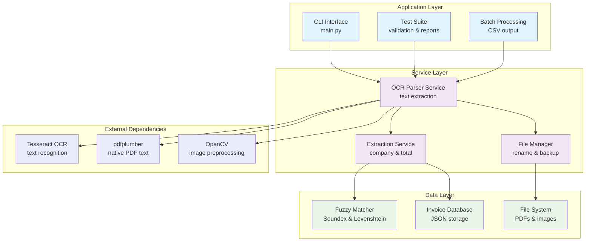
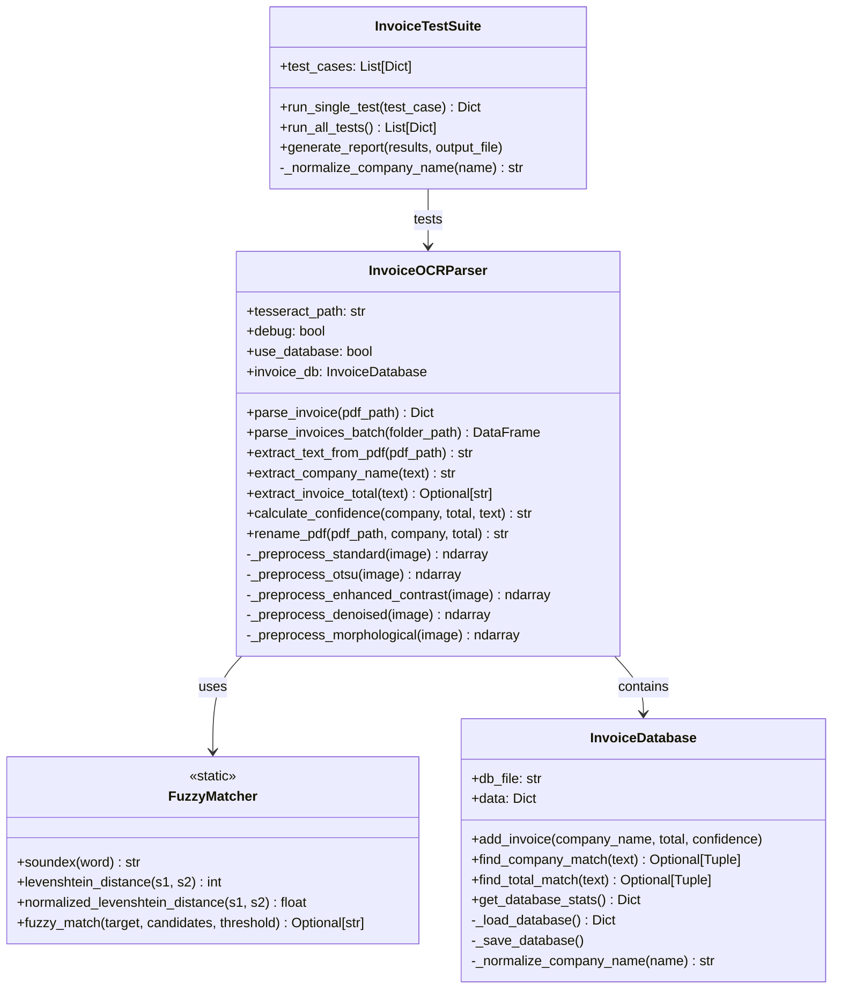
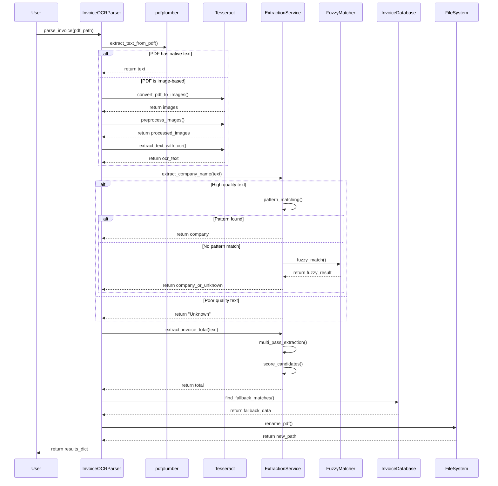
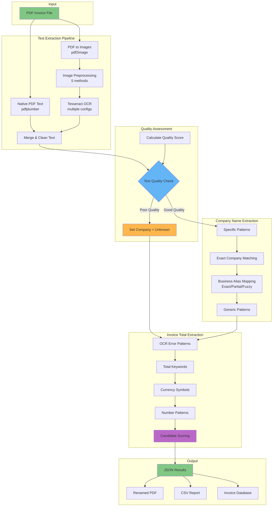

# OCR Invoice Parser - Technical Architecture

## 1. System Architecture

### 1.1 High-Level Architecture



### 1.2 Class Hierarchy and Relationships



### 1.3 Processing Sequence



### 1.4 Data Flow Architecture



## 2. Design Patterns and Principles

### 2.1 Design Patterns Used

#### Strategy Pattern
```python
class OCRStrategy:
    def extract_text(self, images):
        pass

class StandardOCR(OCRStrategy):
    def extract_text(self, images):
        # Standard preprocessing + OCR
        
class EnhancedOCR(OCRStrategy):
    def extract_text(self, images):
        # Enhanced preprocessing + OCR
```

#### Template Method Pattern
```python
def extract_invoice_total(self, text):
    # Template method with multiple passes
    candidates = []
    
    # Pass 1: Specific patterns (hook method)
    candidates.extend(self._extract_specific_patterns(text))
    
    # Pass 2: High priority patterns (hook method)
    candidates.extend(self._extract_high_priority_patterns(text))
    
    # Pass 3: Currency patterns (hook method)
    candidates.extend(self._extract_currency_patterns(text))
    
    # Pass 4: General patterns (hook method)
    candidates.extend(self._extract_general_patterns(text))
    
    return self._select_best_candidate(candidates)
```

#### Factory Pattern
```python
class PreprocessorFactory:
    @staticmethod
    def create_preprocessor(method):
        if method == "standard":
            return StandardPreprocessor()
        elif method == "otsu":
            return OtsuPreprocessor()
        elif method == "enhanced":
            return EnhancedPreprocessor()
        # ... etc
```

### 2.2 SOLID Principles

#### Single Responsibility Principle (SRP)
- `FuzzyMatcher`: Only handles string similarity algorithms
- `InvoiceDatabase`: Only handles data persistence and retrieval
- `InvoiceOCRParser`: Only handles invoice processing orchestration

#### Open/Closed Principle (OCP)
- New preprocessing methods can be added without modifying existing code
- New extraction patterns can be added through configuration
- New fuzzy matching algorithms can be plugged in

#### Dependency Inversion Principle (DIP)
- High-level modules don't depend on low-level modules
- Both depend on abstractions (interfaces)

### 2.2 Data Layer

#### 2.2.1 Configuration Files
- **business_aliases.json**: Business name mapping configuration
- **invoice_database.json**: Optional database for fallback matching (disabled by default)

#### 2.2.2 Invoice Database (Optional)
The invoice database provides fallback matching capabilities for business names and is **disabled by default**.

**Features**:
- Stores known business names
- Provides fuzzy matching for company names
- Automatic learning from successful extractions
- Company name frequency tracking

**Usage**:
```python
# Default: Database disabled
parser = InvoiceOCRParser()

# Enable database functionality
parser = InvoiceOCRParser(use_database=True)
```

## 3. Data Structures and Algorithms

### 3.1 Core Data Structures

#### Candidate Tuple
```python
Candidate = Tuple[float, str, float, str]
# (amount, source_line, score, pattern_type)
```

#### Invoice Result Dictionary
```python
InvoiceResult = {
    "company_name": str,
    "invoice_total": str,
    "confidence": str,  # "high", "medium", "low"
    "extraction_method": str,  # "text_extraction", "ocr"
    "processing_time": float,
    "renamed_path": str
}
```

#### Test Case Structure
```python
TestCase = {
    "pdf_path": str,
    "expected_company": str,
    "expected_total": float
}
```

### 3.2 Key Algorithms

#### Soundex Algorithm Implementation
```python
def soundex(word: str) -> str:
    """
    Time Complexity: O(n) where n is word length
    Space Complexity: O(1)
    """
    if not word:
        return "0000"
    
    word = word.upper()
    soundex_code = word[0]
    
    # Mapping consonants to numbers
    mapping = {
        'BFPV': '1', 'CGJKQSXZ': '2', 'DT': '3',
        'L': '4', 'MN': '5', 'R': '6'
    }
    
    for char in word[1:]:
        for consonants, number in mapping.items():
            if char in consonants:
                if soundex_code[-1] != number:  # Avoid duplicates
                    soundex_code += number
                break
    
    # Pad or truncate to 4 characters
    soundex_code = soundex_code.ljust(4, '0')[:4]
    return soundex_code
```

#### Levenshtein Distance (Dynamic Programming)
```python
def levenshtein_distance(s1: str, s2: str) -> int:
    """
    Time Complexity: O(m*n) where m,n are string lengths
    Space Complexity: O(m*n)
    """
    if len(s1) < len(s2):
        return levenshtein_distance(s2, s1)
    
    if len(s2) == 0:
        return len(s1)
    
    # Create matrix
    previous_row = list(range(len(s2) + 1))
    for i, c1 in enumerate(s1):
        current_row = [i + 1]
        for j, c2 in enumerate(s2):
            insertions = previous_row[j + 1] + 1
            deletions = current_row[j] + 1
            substitutions = previous_row[j] + (c1 != c2)
            current_row.append(min(insertions, deletions, substitutions))
        previous_row = current_row
    
    return previous_row[-1]
```

#### Scoring Algorithm for Amount Candidates
```python
def calculate_candidate_score(amount: float, line: str, pattern_type: str) -> float:
    """
    Multi-criteria scoring function
    Time Complexity: O(1)
    """
    # Base scores (logarithmic scale for clear priority)
    base_scores = {
        "specific": 1000,      # 10x higher than high_priority
        "high_priority": 100,  # 2x higher than currency
        "currency": 50,        # 5x higher than number
        "number": 10
    }
    
    score = base_scores.get(pattern_type, 1)
    
    # Context bonuses (additive)
    keywords = {
        "TOTAL": 25, "MONTANT": 20, "$": 15, "CAD": 10,
        "DUE": 8, "BALANCE": 8, "AMOUNT": 5
    }
    
    line_upper = line.upper()
    for keyword, bonus in keywords.items():
        if keyword in line_upper:
            score += bonus
    
    # Amount range scoring (multiplicative)
    if 10 <= amount <= 100000:
        score *= 1.1
    elif 100 <= amount <= 10000:
        score *= 1.05
    elif amount < 1:
        score *= 0.5  # Penalty for very small amounts
    elif amount > 100000:
        score *= 0.7  # Penalty for very large amounts
    
    return score
```

## 4. Performance Considerations

### 4.1 Time Complexity Analysis

| Operation | Time Complexity | Notes |
|-----------|-----------------|-------|
| PDF Text Extraction | O(n) | n = number of pages |
| OCR Processing | O(p*m*k) | p=pages, m=pixels, k=configs |
| Pattern Matching | O(n*p) | n=lines, p=patterns |
| Fuzzy Matching | O(n*m²) | n=candidates, m=string length |
| File Renaming | O(1) | Simple file system operation |

### 4.2 Memory Usage Optimization

#### Image Processing Memory Management
```python
def process_images_memory_efficient(self, images):
    """Process images one at a time to minimize memory usage"""
    results = []
    for image in images:
        # Process single image
        result = self._process_single_image(image)
        results.append(result)
        # Explicitly delete to free memory
        del image
        gc.collect()
    return results
```

#### Lazy Loading for Large Batches
```python
def process_batch_lazy(self, pdf_paths):
    """Generator-based processing for large batches"""
    for pdf_path in pdf_paths:
        yield self.parse_invoice(pdf_path)
        # Memory is freed after each yield
```

### 4.3 Caching Strategy

#### Result Caching
```python
from functools import lru_cache

class InvoiceOCRParser:
    @lru_cache(maxsize=100)
    def _cached_ocr_extract(self, image_hash):
        """Cache OCR results for identical images"""
        # OCR processing is expensive, cache results
        pass
```

## 5. Error Handling and Resilience

### 5.1 Exception Hierarchy

```python
class InvoiceProcessingError(Exception):
    """Base exception for invoice processing errors"""
    pass

class PDFReadError(InvoiceProcessingError):
    """PDF file cannot be read or is corrupted"""
    pass

class OCRError(InvoiceProcessingError):
    """OCR processing failed"""
    pass

class ExtractionError(InvoiceProcessingError):
    """Data extraction failed"""
    pass

class FileSystemError(InvoiceProcessingError):
    """File system operations failed"""
    pass
```

### 5.2 Retry Mechanisms

```python
from functools import wraps
import time

def retry(max_attempts=3, delay=1, backoff=2):
    def decorator(func):
        @wraps(func)
        def wrapper(*args, **kwargs):
            attempts = 0
            current_delay = delay
            
            while attempts < max_attempts:
                try:
                    return func(*args, **kwargs)
                except (OCRError, FileSystemError) as e:
                    attempts += 1
                    if attempts == max_attempts:
                        raise e
                    time.sleep(current_delay)
                    current_delay *= backoff
            
        return wrapper
    return decorator

@retry(max_attempts=3)
def extract_text_with_ocr(self, images):
    # OCR extraction with retry logic
    pass
```

### 5.3 Graceful Degradation

```python
def extract_company_name_with_fallback(self, text):
    """Multiple fallback strategies for company extraction"""
    try:
        # Primary strategy: Pattern matching
        company = self._extract_company_patterns(text)
        if company:
            return company
    except Exception as e:
        logger.warning(f"Pattern matching failed: {e}")
    
    try:
        # Fallback 1: Fuzzy matching
        company = self._extract_company_fuzzy(text)
        if company:
            return company
    except Exception as e:
        logger.warning(f"Fuzzy matching failed: {e}")
    
    try:
        # Fallback 2: Database lookup
        company = self._lookup_company_database(text)
        if company:
            return company
    except Exception as e:
        logger.warning(f"Database lookup failed: {e}")
    
    # Final fallback: Return "Unknown"
    return "Unknown"
```

## 6. Security Considerations

### 6.1 Input Validation

```python
def validate_pdf_file(self, pdf_path):
    """Validate PDF file before processing"""
    # Check file existence
    if not os.path.exists(pdf_path):
        raise FileNotFoundError(f"PDF file not found: {pdf_path}")
    
    # Check file size (prevent memory exhaustion)
    file_size = os.path.getsize(pdf_path)
    if file_size > MAX_FILE_SIZE:
        raise ValueError(f"File too large: {file_size} bytes")
    
    # Check file type
    if not pdf_path.lower().endswith('.pdf'):
        raise ValueError("File must be a PDF")
    
    # Check PDF magic bytes
    with open(pdf_path, 'rb') as f:
        header = f.read(4)
        if header != b'%PDF':
            raise ValueError("Invalid PDF file format")
```

### 6.2 Path Traversal Prevention

```python
def sanitize_filename(self, filename):
    """Prevent path traversal attacks in filenames"""
    # Remove path separators
    filename = os.path.basename(filename)
    
    # Remove dangerous characters
    dangerous_chars = ['<', '>', ':', '"', '|', '?', '*']
    for char in dangerous_chars:
        filename = filename.replace(char, '_')
    
    # Limit filename length
    if len(filename) > 255:
        filename = filename[:255]
    
    return filename
```

### 6.3 Temporary File Handling

```python
import tempfile
import contextlib

@contextlib.contextmanager
def temporary_images(self, pdf_path):
    """Secure temporary file handling for image conversion"""
    temp_dir = None
    try:
        temp_dir = tempfile.mkdtemp(prefix='invoice_ocr_')
        images = self.convert_pdf_to_images(pdf_path, temp_dir)
        yield images
    finally:
        # Cleanup temporary files
        if temp_dir and os.path.exists(temp_dir):
            shutil.rmtree(temp_dir, ignore_errors=True)
```

## 7. Configuration Management

### 7.1 Configuration Structure

```python
import configparser
from dataclasses import dataclass
from typing import List, Dict

@dataclass
class OCRConfig:
    dpi: int = 300
    tesseract_configs: List[str] = None
    preprocessing_methods: List[str] = None
    confidence_threshold: float = 2.0
    garbled_threshold: float = 0.3

@dataclass
class ExtractionConfig:
    search_lines: int = 25
    max_company_length: int = 50
    min_company_length: int = 3
    amount_range: List[float] = None
    fuzzy_threshold: float = 0.8
    known_companies: List[str] = None

class ConfigManager:
    def __init__(self, config_file='config.ini'):
        self.config = configparser.ConfigParser()
        self.config.read(config_file)
        
    def get_ocr_config(self) -> OCRConfig:
        return OCRConfig(
            dpi=self.config.getint('OCR', 'dpi', fallback=300),
            confidence_threshold=self.config.getfloat('OCR', 'confidence_threshold', fallback=2.0)
            # ... etc
        )
```

### 7.2 Environment-Specific Configuration

```ini
# config.ini
[OCR]
dpi = 300
confidence_threshold = 2.0
garbled_threshold = 0.3
tesseract_path = /usr/local/bin/tesseract

[EXTRACTION]
search_lines = 25
fuzzy_threshold = 0.8
max_company_length = 50

[FILES]
backup_directory = ./backup
output_directory = ./output
max_file_size = 52428800  # 50MB

[LOGGING]
level = INFO
format = %(asctime)s - %(levelname)s - %(message)s
file = invoice_parser.log
```

## 8. Testing Strategy

### 8.1 Unit Testing Architecture

```python
import unittest
from unittest.mock import Mock, patch

class TestInvoiceOCRParser(unittest.TestCase):
    def setUp(self):
        self.parser = InvoiceOCRParser(debug=True)
        
    def test_extract_company_name_success(self):
        text = "La Forfaiterie\nInvoice #123"
        result = self.parser.extract_company_name(text)
        self.assertEqual(result, "La Forfaiterie")
        
    def test_extract_company_name_poor_quality(self):
        text = "∞∂ƒ†¥˙ß∂ƒ∆˙©˙∆߃†¥"  # Garbled text
        result = self.parser.extract_company_name(text)
        self.assertEqual(result, "Unknown")
        
    @patch('pdf2image.convert_from_path')
    def test_ocr_fallback(self, mock_convert):
        mock_convert.return_value = [Mock()]
        # Test OCR fallback when PDF text extraction fails
```

### 8.2 Integration Testing

```python
class TestIntegration(unittest.TestCase):
    def test_end_to_end_processing(self):
        """Test complete pipeline from PDF to renamed file"""
        test_pdf = "test_data/sample_invoice.pdf"
        result = self.parser.parse_invoice(test_pdf)
        
        # Verify extraction
        self.assertIn('company_name', result)
        self.assertIn('invoice_total', result)
        
        # Verify file renaming
        expected_filename = f"{result['company_name']}-${result['invoice_total']}.pdf"
        self.assertTrue(os.path.exists(expected_filename))
```

### 8.3 Performance Testing

```python
import time
import psutil

class TestPerformance(unittest.TestCase):
    def test_processing_speed(self):
        """Ensure processing speed meets requirements"""
        start_time = time.time()
        result = self.parser.parse_invoice("large_invoice.pdf")
        processing_time = time.time() - start_time
        
        self.assertLess(processing_time, 30)  # Less than 30 seconds
        
    def test_memory_usage(self):
        """Ensure memory usage stays within limits"""
        process = psutil.Process()
        initial_memory = process.memory_info().rss
        
        result = self.parser.parse_invoice("large_invoice.pdf")
        
        final_memory = process.memory_info().rss
        memory_increase = final_memory - initial_memory
        
        self.assertLess(memory_increase, 500 * 1024 * 1024)  # Less than 500MB
```

## 9. Deployment and Maintenance

### 9.1 Docker Containerization

```dockerfile
FROM python:3.9-slim

# Install system dependencies
RUN apt-get update && apt-get install -y \
    tesseract-ocr \
    tesseract-ocr-fra \
    poppler-utils \
    && rm -rf /var/lib/apt/lists/*

# Set working directory
WORKDIR /app

# Copy requirements and install Python dependencies
COPY requirements.txt .
RUN pip install --no-cache-dir -r requirements.txt

# Copy application code
COPY . .

# Create necessary directories
RUN mkdir -p backup output logs

# Set environment variables
ENV PYTHONPATH=/app
ENV TESSERACT_CMD=/usr/bin/tesseract

# Run the application
CMD ["python", "invoice_ocr_parser_cli.py"]
```

### 9.2 Monitoring and Logging

```python
import logging
import logging.handlers
from datetime import datetime

class MonitoringMixin:
    def setup_monitoring(self):
        # Rotating log files
        handler = logging.handlers.RotatingFileHandler(
            'invoice_parser.log',
            maxBytes=10*1024*1024,  # 10MB
            backupCount=5
        )
        
        formatter = logging.Formatter(
            '%(asctime)s - %(name)s - %(levelname)s - %(message)s'
        )
        handler.setFormatter(formatter)
        
        logger = logging.getLogger('invoice_parser')
        logger.addHandler(handler)
        logger.setLevel(logging.INFO)
        
    def log_performance_metrics(self, operation, duration, success):
        metrics = {
            'timestamp': datetime.now().isoformat(),
            'operation': operation,
            'duration': duration,
            'success': success,
            'memory_usage': psutil.Process().memory_info().rss
        }
        logger.info(f"METRICS: {json.dumps(metrics)}")
```

This technical architecture document provides the implementation details and technical considerations that complement the functional specification, giving a senior programmer everything needed to build a robust, maintainable OCR invoice parser system. 