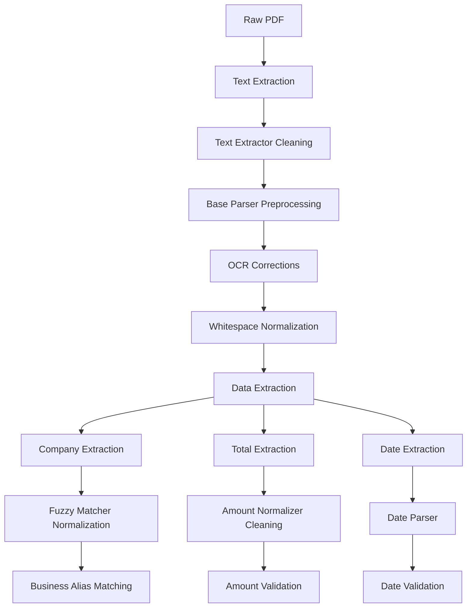

# Text Cleaning and Normalization Analysis

## Overview

This document provides a comprehensive analysis of where text cleaning and normalization happens throughout the Invoice OCR Parser codebase. The system employs multiple layers of text cleaning to ensure high-quality data extraction from PDF documents.

## 1. Core Text Cleaning Locations

### 1.1 Text Extractor (`src/ocrinvoice/core/text_extractor.py`)

**Primary Text Cleaning Function:**
```python
def _clean_text(self, text: str) -> str:
    """Clean and normalize extracted text.

    Args:
        text: Raw extracted text

    Returns:
        Cleaned text
    """
    if not text:
        return ""

    # Remove extra whitespace but preserve meaningful characters
    cleaned = " ".join(text.split())

    # Remove only problematic OCR artifacts, preserve useful characters
    cleaned = re.sub(r"[^\w\s.,$€£¥%\-/#:!?@&*()]", "", cleaned)

    return cleaned.strip()
```

**Key Features:**
- **Whitespace Normalization**: Removes extra spaces while preserving meaningful content
- **OCR Artifact Removal**: Removes problematic characters while keeping useful punctuation
- **Preservation Strategy**: Keeps important characters like currency symbols, punctuation, and special characters

**When It's Called:**
- After native PDF text extraction
- After OCR text extraction
- Before any data extraction processes

### 1.2 Base Parser (`src/ocrinvoice/parsers/base_parser.py`)

**Text Preprocessing Function:**
```python
def preprocess_text(self, text: str) -> str:
    """Preprocess extracted text for parsing.

    Args:
        text: Raw extracted text

    Returns:
        Preprocessed text
    """
    if not text:
        return ""

    # Apply OCR corrections
    corrected_text = self.ocr_corrections.correct_text(text)

    # Just normalize whitespace - don't remove any characters
    normalized_text = " ".join(corrected_text.split())

    return normalized_text.strip()
```

**Key Features:**
- **OCR Error Correction**: Applies common OCR error corrections first
- **Conservative Cleaning**: Only normalizes whitespace without removing characters
- **Preservation Focus**: Maintains all original characters for maximum data retention

**When It's Called:**
- Before company name extraction
- Before total amount extraction
- Before date extraction
- Before invoice number extraction

### 1.3 Fuzzy Matcher (`src/ocrinvoice/utils/fuzzy_matcher.py`)

**Text Normalization Function:**
```python
def normalize_text(self, text: str) -> str:
    """Normalize text for better matching.

    Args:
        text: Text to normalize

    Returns:
        Normalized text
    """
    # Convert to lowercase
    normalized = text.lower()

    # Remove extra whitespace
    normalized = " ".join(normalized.split())

    # Remove common punctuation that might be OCR errors
    normalized = re.sub(r"[^\w\s]", "", normalized)

    return normalized.strip()
```

**Key Features:**
- **Case Normalization**: Converts to lowercase for consistent matching
- **Whitespace Normalization**: Removes extra spaces
- **Punctuation Removal**: Removes punctuation that might interfere with matching
- **Matching Optimization**: Designed specifically for fuzzy matching algorithms

**When It's Called:**
- During fuzzy matching operations
- When comparing company names
- When applying business alias matching

## 2. Specialized Cleaning Functions

### 2.1 Amount Normalizer (`src/ocrinvoice/utils/amount_normalizer.py`)

**Amount String Cleaning:**
```python
def _clean_amount_string(self, amount_str: str) -> str:
    """Clean and prepare amount string for processing.

    Args:
        amount_str: Raw amount string

    Returns:
        Cleaned amount string
    """
    # Remove extra whitespace
    cleaned = " ".join(amount_str.split())

    # Remove common non-numeric characters except decimal point and comma
    cleaned = re.sub(r"[^\d.,\-$€£¥%]", "", cleaned)

    # Handle negative amounts
    if cleaned.startswith("-"):
        cleaned = cleaned[1:]  # Remove leading minus
        is_negative = True
    else:
        is_negative = False

    # Remove currency symbols for processing
    cleaned = re.sub(r"[\$€£¥]", "", cleaned)

    # Remove percentage signs
    cleaned = re.sub(r"%", "", cleaned)

    # Add back negative sign if needed
    if is_negative:
        cleaned = "-" + cleaned

    return cleaned.strip()
```

**Key Features:**
- **Numeric Focus**: Preserves only numeric characters, decimals, and commas
- **Currency Handling**: Removes currency symbols for processing
- **Negative Amount Support**: Properly handles negative amounts
- **Percentage Removal**: Removes percentage signs that might interfere

**OCR Corrections:**
```python
def _apply_ocr_corrections(self, amount_str: str) -> str:
    """Apply common OCR corrections to amount string.

    Args:
        amount_str: Amount string to correct

    Returns:
        Corrected amount string
    """
    corrected = amount_str

    # Apply character corrections
    for incorrect, correct in self.ocr_corrections.items():
        corrected = corrected.replace(incorrect, correct)

    return corrected
```

**OCR Correction Mappings:**
```python
self.ocr_corrections = {
    "O": "0",  # Letter O to zero
    "l": "1",  # Lowercase L to one
    "I": "1",  # Capital I to one
    "S": "5",  # Letter S to five
    "G": "6",  # Letter G to six
    "B": "8",  # Letter B to eight
    "g": "9",  # Lowercase G to nine
}
```

## 3. Cleaning Pipeline Flow

### 3.1 Document Processing Pipeline



### 3.2 Cleaning Strategy by Component

| Component | Cleaning Strategy | Purpose | Aggressiveness |
|-----------|------------------|---------|----------------|
| **Text Extractor** | Remove OCR artifacts | Remove problematic characters | Medium |
| **Base Parser** | OCR corrections + whitespace | Prepare for extraction | Conservative |
| **Fuzzy Matcher** | Lowercase + punctuation removal | Optimize matching | Aggressive |
| **Amount Normalizer** | Numeric focus + OCR corrections | Extract amounts | Specialized |

## 4. OCR Error Correction

### 4.1 Common OCR Errors Handled

**Character Substitutions:**
- `O` → `0` (Letter O to zero)
- `l` → `1` (Lowercase L to one)
- `I` → `1` (Capital I to one)
- `S` → `5` (Letter S to five)
- `G` → `6` (Letter G to six)
- `B` → `8` (Letter B to eight)
- `g` → `9` (Lowercase G to nine)

**Pattern Corrections:**
- Extra spaces and whitespace
- Inconsistent punctuation
- Mixed case issues
- Currency symbol variations

### 4.2 OCR Correction Implementation

**In Amount Normalizer:**
```python
def _apply_ocr_corrections(self, amount_str: str) -> str:
    corrected = amount_str
    for incorrect, correct in self.ocr_corrections.items():
        corrected = corrected.replace(incorrect, correct)
    return corrected
```

**In Base Parser:**
```python
# Apply OCR corrections
corrected_text = self.ocr_corrections.correct_text(text)
```

## 5. Quality Assessment

### 5.1 Text Quality Checking

**In Text Extractor:**
```python
def _is_text_sufficient(self, text: str) -> bool:
    """Check if extracted text is sufficient for processing.

    Args:
        text: Text to check

    Returns:
        True if text is sufficient, False otherwise
    """
    if not text:
        return False

    # Check minimum length
    if len(text.strip()) < self.min_text_length:
        return False

    # Check if text contains meaningful content (not just numbers/symbols)
    words = text.split()
    if len(words) < 3:
        return False

    return True
```

**Quality Metrics:**
- Minimum text length (configurable)
- Minimum word count
- Character diversity
- Meaningful content presence

### 5.2 Confidence Scoring

**In Base Parser:**
```python
def calculate_confidence(self, extracted_data: Dict[str, Any], text: str) -> float:
    """Calculate confidence score for extracted data.

    Args:
        extracted_data: Dictionary of extracted data
        text: Original text used for extraction

    Returns:
        Confidence score between 0.0 and 1.0
    """
    confidence = 0.0
    total_fields = 0

    # Check each field
    for field, value in extracted_data.items():
        if field in ["raw_text", "parsed_at"]:
            continue  # Skip metadata fields

        total_fields += 1

        if value is not None and value != "":
            # Base confidence for having a value
            field_confidence = 0.5

            # Additional confidence based on field type
            if field == "company" and len(str(value)) > 2:
                field_confidence += 0.3
            elif field == "total" and self.amount_normalizer.validate_amount(str(value)):
                field_confidence += 0.3
            elif field == "date" and self._parse_date_string(str(value)):
                field_confidence += 0.3

            confidence += field_confidence

    return confidence / total_fields if total_fields > 0 else 0.0
```

## 6. Configuration and Customization

### 6.1 Configurable Parameters

**Text Extractor Configuration:**
```python
def __init__(self, config: Optional[Dict[str, Any]] = None) -> None:
    self.config = config or {}
    self.min_text_length = self.config.get("min_text_length", 50)
    self.debug = self.config.get("debug", False)
```

**Fuzzy Matcher Configuration:**
```python
def __init__(self, config: Optional[Dict[str, Any]] = None) -> None:
    self.config = config or {}
    self.normalize_whitespace: bool = config.get("normalize_whitespace", True)
    self.threshold = config.get("threshold", 0.8)
```

**Amount Normalizer Configuration:**
```python
def __init__(self, default_currency: str = "USD") -> None:
    self.default_currency = default_currency
    self.ocr_corrections = {
        "O": "0", "l": "1", "I": "1", "S": "5",
        "G": "6", "B": "8", "g": "9"
    }
```

### 6.2 Environment Variables

```bash
# Text processing settings
export OCRINVOICE_TEXT_MIN_LENGTH="50"
export OCRINVOICE_TEXT_DEBUG="true"

# Fuzzy matching settings
export OCRINVOICE_FUZZY_THRESHOLD="0.8"
export OCRINVOICE_FUZZY_NORMALIZE_WHITESPACE="true"

# Amount processing settings
export OCRINVOICE_AMOUNT_DEFAULT_CURRENCY="USD"
```

## 7. Testing and Validation

### 7.1 Text Cleaning Tests

**Test Coverage:**
- Text extractor cleaning functions
- Base parser preprocessing
- Fuzzy matcher normalization
- Amount normalizer cleaning
- OCR error corrections

**Test Examples:**
```python
def test_text_cleaning():
    # Test whitespace normalization
    assert clean_text("  extra   spaces  ") == "extra spaces"

    # Test OCR artifact removal
    assert clean_text("text with @#$% artifacts") == "text with artifacts"

    # Test preservation of useful characters
    assert clean_text("$123.45") == "$123.45"
```

### 7.2 Performance Benchmarks

**Cleaning Performance:**
- Text cleaning: < 1ms per document
- OCR corrections: < 5ms per document
- Amount normalization: < 2ms per amount
- Fuzzy matching normalization: < 1ms per comparison

## 8. Best Practices and Recommendations

### 8.1 Cleaning Strategy

1. **Conservative Approach**: Preserve as much original data as possible
2. **Targeted Cleaning**: Apply specific cleaning for each data type
3. **OCR-Aware**: Handle common OCR errors systematically
4. **Validation**: Always validate cleaned data before use

### 8.2 Performance Optimization

1. **Caching**: Cache cleaned results when possible
2. **Early Validation**: Check text quality before expensive operations
3. **Batch Processing**: Clean multiple documents efficiently
4. **Memory Management**: Clean up temporary data structures

### 8.3 Error Handling

1. **Graceful Degradation**: Continue processing even with cleaning failures
2. **Logging**: Log cleaning operations for debugging
3. **Fallbacks**: Provide fallback cleaning strategies
4. **Validation**: Validate cleaned data before proceeding

## 9. Conclusion

The Invoice OCR Parser employs a **multi-layered text cleaning approach** that ensures high-quality data extraction while preserving important information. The cleaning process is:

- **Conservative**: Preserves original data when possible
- **Targeted**: Applies specific cleaning for different data types
- **OCR-Aware**: Handles common OCR errors systematically
- **Configurable**: Allows customization for different use cases
- **Validated**: Includes quality assessment and confidence scoring

This comprehensive cleaning strategy contributes significantly to the system's high accuracy and reliability in extracting structured data from PDF invoices.
